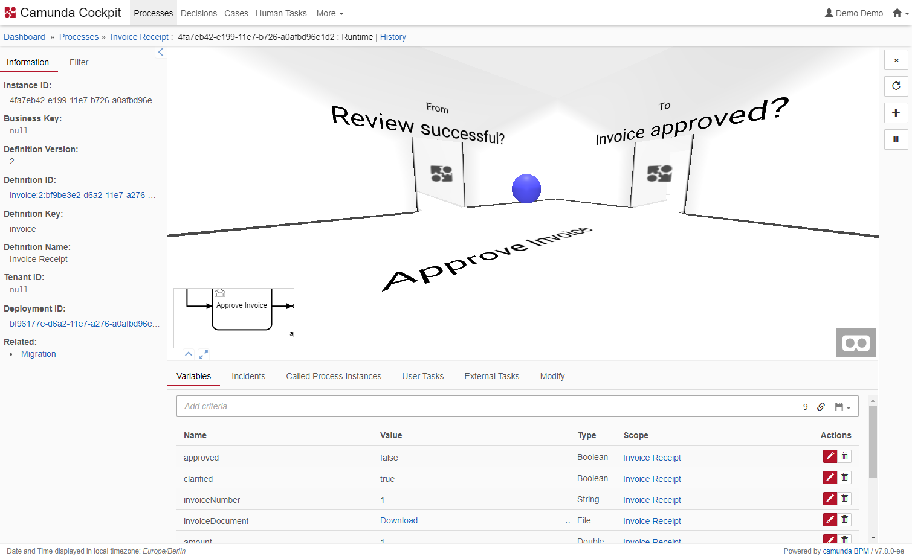

Camunda Token View
=================================

This Cockpit plugin allows you to jump into your process instance and watch your tokens flow.

Built and tested against Camunda BPM version `7.8.0`.




Integrate into Camunda Webapp
-----------------------------

Copy the contents of this repository into a new directory called `tokenView` in the `app/cockpit/scripts/` folder in your Camunda webapp distribution. For the Tomcat distribution, this would be `server/apache-tomcat-X.X.XX/webapps/camunda/app/cockpit/scripts/tokenView`.

Add the following content to the `customScripts` object in the `app/cockpit/scripts/config.js` file:

```
  // …
  customScripts: {
    ngDeps: ['cockpit.tokenView'],

    deps: ['tokenView'],

    // RequreJS path definitions
    paths: {
      'tokenView': 'scripts/tokenView/index'
    }
  }
  // …
```

License
-------

Use under terms of the [Apache License, Version 2.0](http://www.apache.org/licenses/LICENSE-2.0)
